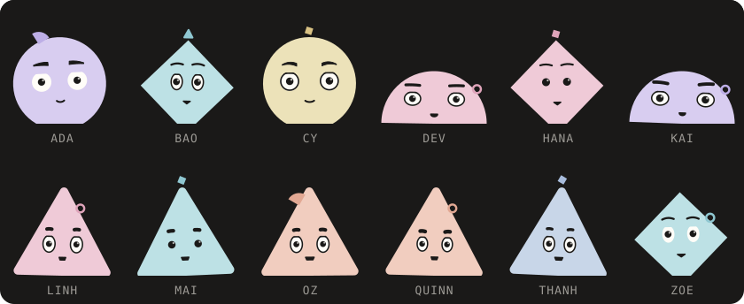
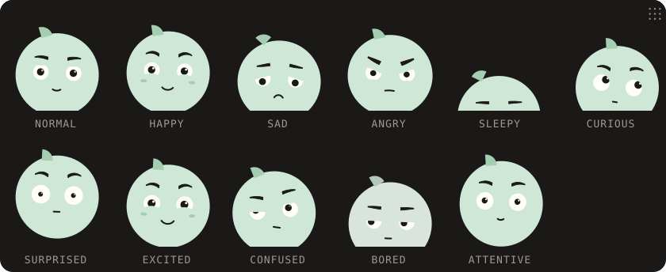

#  Peek

[](https://www.npmjs.com/package/@doan-labs/peek)
[](./LICENSE)


A string in, a face out. The same name gives the same face, on the server
and in the browser, as pure SVG.

```sh
npm install @doan-labs/peek
```

```tsx
import { Peek } from '@doan-labs/peek'

<Peek name='Linh' expression='happy' animate gaze='pointer' />
```

No React? `toSvg('Linh')` returns the SVG string, with no runtime
dependencies.

## Same name, same face

No storage, no network, no randomness. The face is worked out from the
name every time.



## A face that looks back

Expressions, gaze and blinking, all opt-in. Change `expression` and an
animated face eases there.



## Props

| Prop | Type | Default |
| --- | --- | --- |
| `name` | `string` | required |
| `size` | `number` (px) | `64` |
| `expression` | `normal` `happy` `sad` `angry` `sleepy` `curious` `surprised` `excited` `confused` `bored` `attentive` | `normal` |
| `gaze` | `[x, y]` in -1..1, or `'pointer'` | none |
| `animate` | `boolean` | `false` |
| `frame` | `ink` `bone` `paper` `none` | `ink` |
| `square` | `boolean`, false clips to a circle | `true` |
| `title` | `string`, or `false` to hide it | the name |
| `riso` | `boolean`, print grain from 120px | `false` |
| `version` | `number`, pin it to keep today's faces | latest |
| `face` `color` `eyes` … | override one axis of the identity | hashed |

`toSvg(name, options)` takes the same options, minus `animate`, `className`,
`style` and the pointer gaze. Full reference in the
[docs](https://peek.doan-labs.com/docs).

[Docs](https://peek.doan-labs.com/docs) ·
[Changelog](https://peek.doan-labs.com/docs/changelog) ·
[npm](https://www.npmjs.com/package/@doan-labs/peek)

## Develop

```sh
bun install
bun run dev    # the site on :5173
bun run build
```

The library is `packages/peek`, the site is `apps/web`. Regenerate the
images above with `bun scripts/banner.ts` in `packages/peek`.

## License

The code is [MIT](./LICENSE) © Doan Labs. The Doan Labs name and mark are
not covered by the license.

---

<p align="center">
  <a href="https://doan-labs.com"></a><br>
  A product by <a href="https://doan-labs.com">Doan Labs</a>
</p>
